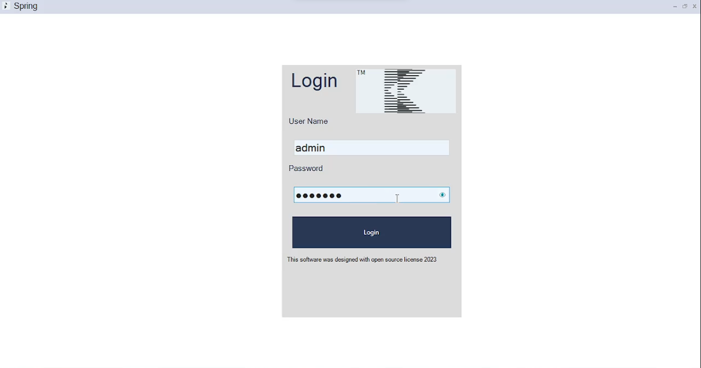
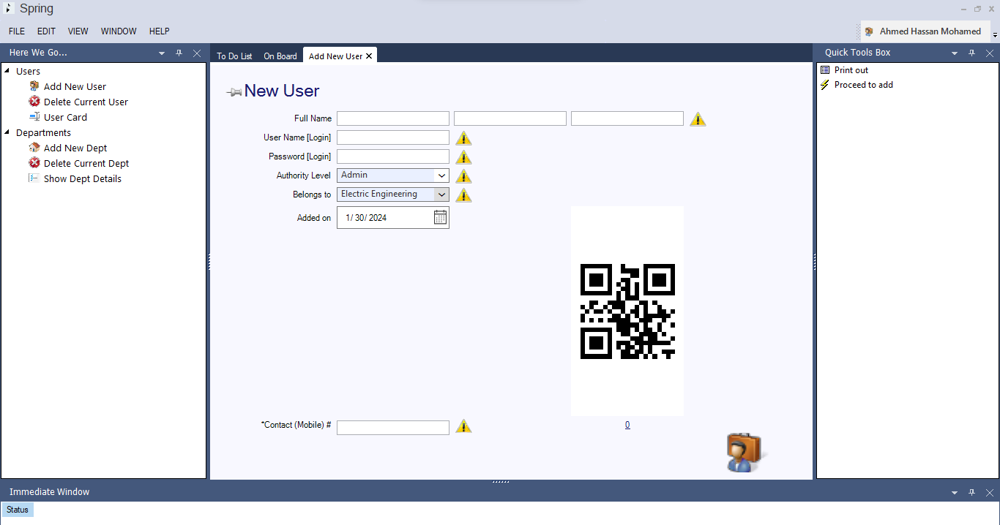
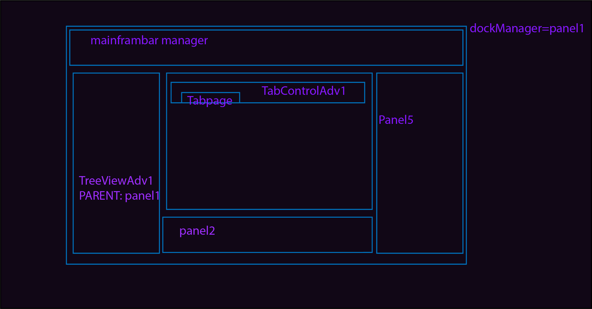
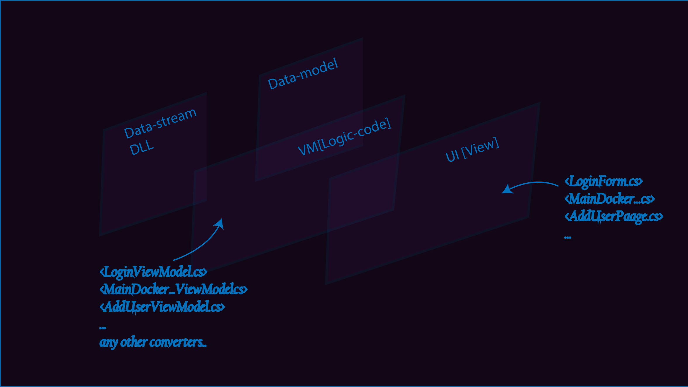

# Spring
</br>Our new project is built to serve MVVM pattern and Oracle sql commands with new .dll easy static funcs.</br></br>
<p align="center">
<kbd>

</kbd>
</p>
</br>

<!-- ABOUT THE PROJECT -->
## About The Project: 💼</br>
* It took 2 years to manage to combine binding properties with a/an speed and reliability UI experience</br>we use dotNet concepts ex. weavers and memory management system with some dlls and tweaks.

</br></br>

<!-- ABOUT THE PROJECT -->
## Database Version: 💉</br>
* In the project we use <a href="https://en.wikipedia.org/wiki/Oracle_Database">Oracle</a> Database through Oracle with (ManagedDataAccess.dll) this library can be used as 
a connection object and execute all sql commands as string.

</br>

<!-- SCREENS -->
## Screens shots: 📷</br>

* Login </br></br>
<a href=""></a>
* User page </br></br>
<a href=""></a>

* PDF extract demo </br></br>
 <a href="https://www.youtube.com/watch?v=SRUvmEIImJY"></a>
         

* Design on Site </br></br>
<a href=""></a>
</br>


What you need to know:.🫡 </br>
#1 this SW using database managed dll for oracle version 10g.<br>
#2 you should know how to build all tables to act inside scripts.<br>
#3 working in adding .cs file to handle main SQL commands and quiries.<br>
</br></br>
<div>
- [View Architecture] 🎲

- [Layers] 🪢

</div>
Very Impertant!</br>
#1 first thing first you must build your database.</br>
#2 I will put down the structure script you may need to change it.</br>
<a href="https://dbdiagram.io/d/65cb61dbac844320ae0acc30">🫳Link to ERD</a></br>

#3 we use 'params.info' for initialize the server parameters and some other data about the current corporation.</br>
<a href="https://imgbb.com/"></a>
</br>
params.info :
````
 
**this file is to initialize the current database connection to make app connect to its server**
**don't try to move lines down or up this will miss the whole file just change data values**
[
#server_ip::127.0.0.1,
#port::1521,
#company_name::Haam Corporation,
#version::1.1.0,
#console::False,
]

````
<!-- VIDEO -->
## To Do List: ⛏️</br>
- [x] Add params file in the project.
- [x] Convert Scripts.cs to .dll library. (Now migrating to .dll as library to use!) from "using AccioInventory.DBConnection;" to "using AccioOracleKit;"
- [x] Integrade QR code.
- [ ] Chart cards usercontrol.